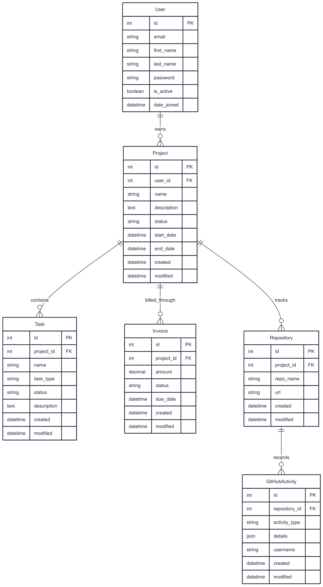

# Freelancer Tracker

A comprehensive freelancer project management and tracking system built with Django REST Framework. This application provides a complete solution for managing freelance work, tracking project progress, monitoring development activities, and handling financial aspects of freelance business.

## Database Schema



## Key Features

- **Project Management**: Track projects with status workflows and timelines
- **Task Organization**: Break down work into categorized tasks (features, bugs, chores)
- **Invoice Tracking**: Manage billing with automated numbering and payment status
- **GitHub Integration**: Monitor repository activities and development progress
- **RESTful API**: Complete REST endpoints for all functionality
- **Email Authentication**: Secure user management without usernames

[](https://github.com/cookiecutter/cookiecutter-django/)
[](https://github.com/astral-sh/ruff)

## Developer Setup (Docker)

### Prerequisites

- Docker Desktop installed and running
- Docker Compose v2
- Git

### Quick Start

1. **Clone the repository**

2. **Set up environment files**

   ```bash
   # Copy environment example files
   cp .env.example .env
   ```

   Edit the environment files if needed to customize settings.

3. **Build and start the application**

   ```bash
   # Build containers
   docker compose -f docker-compose.local.yml build

   # Start all services
   docker compose -f docker-compose.local.yml up -d

   # View logs (optional)
   docker compose -f docker-compose.local.yml logs -f django
   ```

4. **Run database migrations and collect static files**

   ```bash
   # Run database migrations
   bin/manage.sh migrate

   # Collect static files for admin interface styling
   bin/manage.sh collectstatic --noinput
   ```

5. **Create a superuser account**

   ```bash
   bin/manage.sh createsuperuser
   ```

6. **Initialize fake data (development)**

   ```bash
   bin/manage.sh initialize_data
   ```

7. **Access the application**
   - API: http://localhost:8000/api
   - Admin: http://localhost:8000/admin
